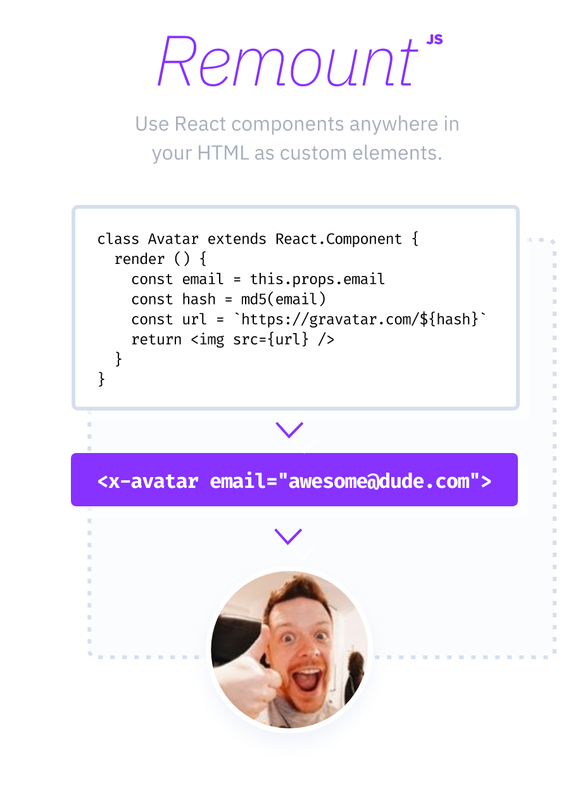

<br>

<p align='center'><a href='https://github.com/rstacruz/remount'></a></p>

<br>

<h1 align='center'>Remount</h1>

<p align='center'>
<a href='https://npmjs.com/package/remount'></a>
&nbsp;
<a href='https://bundlephobia.com/result?p=remount'></a>
</p>

<p align='center'>Use your React components anywhere in your <br> HTML as web components (custom elements).</p>

<p align='center'>
<a href='https://codepen.io/rstacruz/pen/EpBZRv?editors=1010'>Demo</a> ⚡ <a href='https://github.com/rstacruz/remount#remount'>Docs</a>
<br>
<em>2kb gzip'd &nbsp;&middot;&nbsp; No dependencies &nbsp;&middot;&nbsp; IE support</em>
</p>

<br>

<br>

## Installation

Remount is available through the npm package repository. React 18 is required.

```sh
# npm
npm install remount react react-dom
# yarn
yarn add remount react react-dom
```

- Via yarn: `yarn add remount`
- or npm: `npm install remount`

## Usage

Let's start with any React component. Here's one:

```js
const Greeter = ({ name }) => {
  return <div>Hello, {name}!</div>
}
```

Use _define()_ to define custom elements. Let's define a `<x-greeter>` element:

```js
import { define } from 'remount'

define({ 'x-greeter': Greeter })
```

You can now use it anywhere in your HTML! :boom:

```html
<x-greeter props-json='{"name":"John"}'></x-greeter>
```

⚡ **[API documentation →](docs/api.md)**

## Use cases

Some ideas on why you might want to consider Remount for your project:

|                                                               |                                                                                                                                                                                                            |
| ------------------------------------------------------------- | ---------------------------------------------------------------------------------------------------------------------------------------------------------------------------------------------------------- |
| <br><br><br> | ✨ **Adding React to non-SPA apps** <br> You can use React components on any page of a "regular" HTML site. Great for adding React to apps built on Rails or Phoenix.                                      |
|                                                               |                                                                                                                                                                                                            |
| <br><br><br> | 💞 **Interop with other frameworks** <br> Remount lets you use your React components just like any other HTML element. This means you can use React with Vue, Angular, or any other DOM library/framework. |

## More features

- JSON props (eg, `<x-greeter props-json="{...}">`) ([docs](./docs/api.md))
- Named attributes (eg, `<x-greeter name="John">`) ([docs](./docs/api.md))
- Uses Custom Elements API (when available)
- Fallback to compatible API for other browers
- Shadow DOM mode (when available)

## Browser support

Remount supports all browsers that React 18 supports.

Custom Elements API<sup>[#][custom-elements]</sup> ("Web Components") will be used if it's available (Chrome/67+), and will fallback to a compatible API otherwise.

⚡ [Browser support docs →](./docs/browser_support.md)

[custom-elements]: https://caniuse.com/#search=custom%20elements

## Documentation

- [API documentation](./docs/api.md)
- [Builds](./docs/builds.md) &mdash; ES2015+ and ES Module builds are also provided.
- [FAQ and Troubleshooting](./docs/faq.md) &mdash; Start here if you find any issues.
- [Comparison with alternatives](./docs/comparison.md)
- [Browser support](./docs/browser_support.md)

## Thanks

**remount** © 2022, Rico Sta. Cruz. Released under the [MIT] License.<br>
Authored and maintained by Rico Sta. Cruz with help from contributors ([list][contributors]).

> [ricostacruz.com](http://ricostacruz.com) &nbsp;&middot;&nbsp;
> GitHub [@rstacruz](https://github.com/rstacruz) &nbsp;&middot;&nbsp;
> Twitter [@rstacruz](https://twitter.com/rstacruz)

[mit]: http://mit-license.org/
[contributors]: http://github.com/rstacruz/remount/contributors

<br>

[](https://github.com/rstacruz) &nbsp;
[](https://twitter.com/rstacruz) <br>
